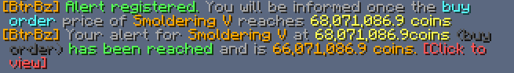
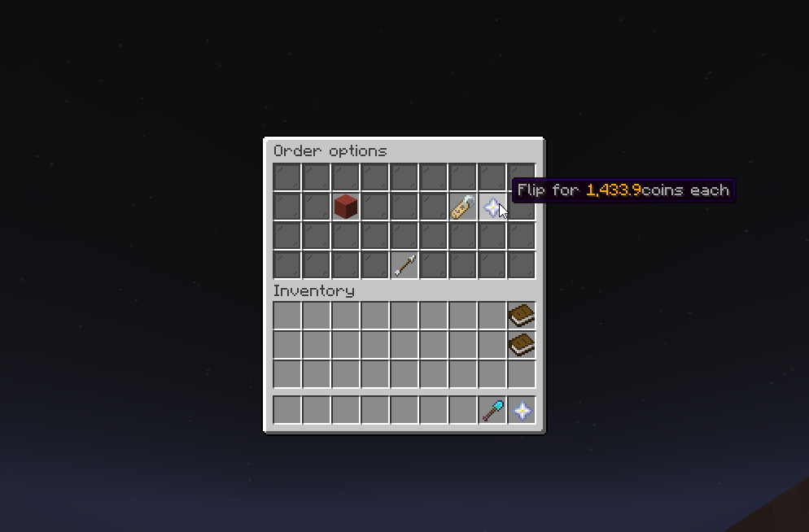
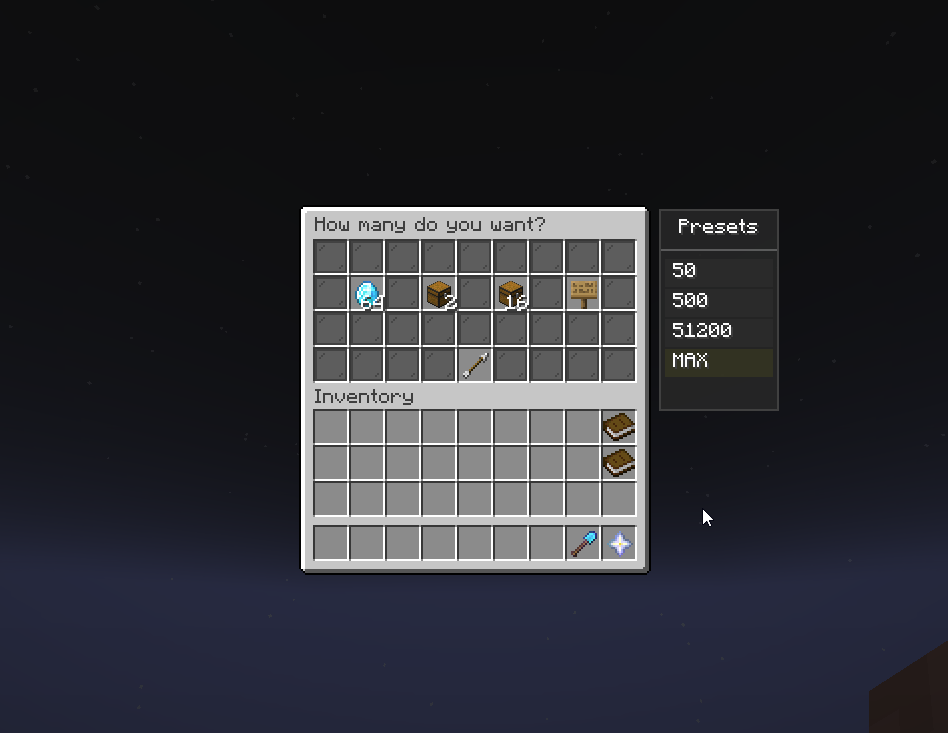

# BtrBz

A comprehensive Hypixel Skyblock quality-of-life mod focused on enhancing the Bazaar experience with
modern features and real-time order tracking.

See the Feature Overview / Core Features for a detailed feature list and usage

## Features Overview

- **Tracked Orders** - Real-time monitoring of order status changes
- **Price Alerts** - Automated notifications when prices reach your targets
- **Order Cancel Actions** - Streamlined navigation after order cancellations
- **Order Protection** - Prevent accidental orders (blocks extreme undercuts and opposing order
  mistakes)
- **Order Highlighting** - Color-coded order status indicators
- **Product Information Provider** - Quick access to external price data
- **Flip Helper** - Automated sell price calculation for quick flips
- **Order Limit Tracker** - Monitor daily transaction limits
- **Bookmarked Items** - Quick-access list for frequently traded items
- **Price Difference Display** - Real-time spread calculations
- **Order Value Overlay** - Track total value of all orders
- **Order Presets** - Reusable order volume templates
- **Tracked Orders List** - Compact widget with hover highlighting

## Note

If you have upgraded your `bazaar flipper` perk in the community shop, you will need to change the
tax rate via `/btrbz tax set <rate>` so that the **Order Limit Tracker** functions correctly.

---

## Core Features

<details>
<summary><strong>Tracked Orders</strong></summary>

Monitor the status of your Bazaar orders in real-time and receive notifications when order states
change.

**Status Types:**

- **Top** - Your order has the best price position
- **Matched** - Multiple orders exist at the same price
- **Undercut** - Someone has outbid your order

**Features:**

- Customizable notifications for each status type
- Option to only notify when regaining best position (reduces spam)
- Automatic navigation to affected items or orders menu
- Color-coded visual highlighting in the Orders screen:
    - 🟢 **Green** - Top position (best price)
    - 🔵 **Blue** - Matched with other orders
    - 🔴 **Red** - Undercut by another order
    - 🟣 **Purple** - Unknown status (no data available)

**Configuration:**

- Toggle notifications for Top, Matched, and Undercut states
- Choose navigation behavior (go to item, open orders menu, or none)
- Enable "priority regain only" mode to reduce notification spam

</details>

<details>
<summary><strong>Price Alerts</strong></summary>

Set up automated price alerts for Bazaar products and receive notifications when market prices reach
your target thresholds.



**Alert Types:**

- **Buy Orders** - Alert when buy order prices reach your target
- **Sell Offers** - Alert when sell offer prices reach your target
- **Insta-Buy** - Alert based on instant buy prices
- **Insta-Sell** - Alert based on instant sell prices

**Features:**

- Dynamic price expressions using mathematical operators
- Reference current market prices in calculations
- Automatic alert removal after triggering
- Reminder notifications for outdated alerts (>1 week, >1 month)
- Persistent alert storage across sessions

**Command Format:**

```
/btrbz alert <product name> <alert type> <price expression>
```

**Alert Type Identifiers:**

- Buy Order: `buy`, `b`, `buyorder`
- Sell Offer: `sell`, `s`, `selloffer`
- Insta-Buy: `instabuy`, `ibuy`, `ib`
- Insta-Sell: `instasell`, `isell`, `is`

**Price Expression Syntax:**

Price expressions support:

- Literal numbers: `88000000`, `88m`, `5.5m`
- Number formatting: `5_000_000`, `5,000,000`
- Suffixes: `k` (thousand), `m` (million), `b` (billion)
- References: `order` (current order price), `insta` (current insta price)
- Operators: `+`, `-`, `*`, `/`
- Parentheses for grouping

**Examples:**

Set alert when Enchanted Gold Block buy orders fall below 2.5 million:

```
/btrbz alert Enchanted Gold Block buy 2.5m
```

_Triggers when buy order price ≤ 2,500,000 coins_

Set alert when Smoldering 5 buy orders drop 5 million below current price:

```
/btrbz alert smoldering 5 buy order - 5m
```

_Uses current buy order price as reference, subtracts 5 million_

Set alert when Bone sell offers reach 88 million:

```
/btrbz alert bone sell 88m
```

_Triggers when sell offer price ≥ 88,000,000 coins_

Set alert when Enchanted Gold Block can be flipped for 10% profit:

```
/btrbz alert Enchanted Gold Block buy order * 1.1
```

_Triggers when (buy order × 1.1) ≤ sell offer price_

**Roman Numeral Support:**

Both roman numerals and numbers are supported:

- `Smoldering V` or `Smoldering 5`
- `Smoldering III` or `Smoldering 3`
- `Enchanted Book (Protection VI)` or `Enchanted Book (Protection 6)`

**Managing Alerts:**

List active alerts:

```
/btrbz alert list
```

Remove specific alert:
After listing the alerts click the one you would like to remove the command

```
/btrbz alert remove <id>
```

is reserved for internal use (you literally can't use it in a meaningful way)

</details>

<details>
<summary><strong>Order Cancel Actions</strong></summary>

Automatically handle navigation and data management after cancelling Bazaar orders.

**Actions:**

- **Reopen Orders Screen** - Automatically return to order management after cancellation
- **Copy Remaining Amount** - Copy unclaimed item count to clipboard for quick reference
- **Reopen Bazaar Menu** - Return to main Bazaar after completing buy/sell orders

**Configuration:**

- Master switch to enable/disable all cancel actions
- Individual toggles for each action type
- Note: "Reopen Bazaar" executes `/bz` command which requires server round-trip

</details>

<details>
<summary><strong>Order Protection</strong></summary>

Guard against accidentally creating incorrectly priced Buy Orders or Sell Offers. Order Protection
validates an order when you open the buy/sell confirmation and can automatically block the order if
it looks like a mistake.

**Features:**

- Blocks orders that undercut existing orders by more than a configurable percentage (per-side
  sliders for Buy / Sell).
- Prevents creating Sell Offers that are below the current insta-buy price and Buy Orders that are
  above the current insta-sell price when enabled.
- Tooltip integration shows validation state and human-readable reason for blocked orders:
    - ✓ Safe: order passes validation
    - ✗ Blocked: setting order is prevented
    - ⚠ Overridden: validation blocked but Ctrl is held to override
- Hold Ctrl to override a blocked order and allow it to be placed.
- If the product / price could not be resolved it defaults to Safe
- Optional chat messages when a protection blocks an order.

**Configuration:**

- Enable/Disable Order Protection.
- Show Chat Messages — toggle system notifications when protections are triggered.
- Block Percentage Undercut — enable/disable percentage-based blocks.
- Max Buy Order Undercut (%) and Max Sell Offer Undercut (%) — slider values for percentage
  thresholds.
- Block Opposing Order Undercuts — prevents creating Sell Offers below the current buy (insta) price
  and Buy Orders above current sell (insta) price.

</details>

<details>
<summary><strong>Order Highlighting</strong></summary>

Visually distinguish your tracked orders with color-coded highlights in the Orders screen.

**Highlight Colors:**

- 🟢 **Green** - Orders at Top position (best price)
- 🔵 **Blue** - Orders that are Matched (same price as others)
- 🔴 **Red** - Orders that are Undercut (outbid)
- 🟡 **Gold** - Filled orders ready to claim
- 🟣 **Purple** - Unkown, either no data available yet or unrecognized product

Enables instant visual identification of order status without opening individual orders.

</details>

<details>
<summary><strong>Product Information Provider</strong></summary>

Access detailed price information and market data via tooltips of bazaar items or open the product
in a specified info provider page.


**Access Methods:**

1. **Click-based Lookup** - Click custom item in Bazaar item screen
2. **CTRL+SHIFT Shortcut** - Hold CTRL+SHIFT and click any Bazaar item
3. **Price Tooltips** - Hover over items to see current prices

**Features:**

- Display current buy/sell prices in item tooltips
- Show price for individual items or entire stacks (hold SHIFT)
- Works inside and outside Bazaar (configurable)
- Multiple price tracking sites supported:
    - Skyblock.bz (default)
    - Coflnet
    - Skyblock.Finance

**Tooltip Information:**

- Buy Order price (highest current buy order)
- Sell Offer price (lowest current sell offer)
- Stack totals when holding SHIFT
- Auto-detection of enchanted books and items with levels

**Configuration:**

- Toggle item click functionality
- Toggle CTRL+SHIFT shortcut
- Enable/disable outside Bazaar
- Choose preferred price tracking site
- Toggle price tooltips

</details>

<details>
<summary><strong>Flip Helper</strong></summary>

Streamline item flipping by automating price calculations and order setup for filled buy orders.



**Features:**

- Automatic sell price calculation (current sell offer - 0.1)
- Custom "Flip for X coins" button in order options menu

**How It Works:**

1. Right click filled buy order
2. Click the custom "Flip for X coins" item
3. Price automatically calculated and entered

Does not show when no data available

</details>

---

## Modules & Widgets

<details>
<summary><strong>Bookmarked Items Module</strong></summary>

Maintain a scrollable widget showing your frequently traded items for instant access.

**Features:**

- Bookmark items directly from Bazaar item screen
- Scrollable list display with configurable size
- Quick navigation to bookmarked products (requires Cookie Buff)
- Visual bookmark indicator on item stacks
- Persistent bookmarks across sessions
- Drag-and-drop list reordering

**How to Use:**

1. Navigate to an item in the Bazaar
2. Click the item icon - you'll see a gold bookmark (before clicking) indicator
3. The bookmark icon changes to a star, and item appears in your list
4. Click any bookmarked item in the widget to navigate to it (requires Cookie Buff)
5. To remove: Click the item again or SHIFT+Right-Click in the list
6. Adjust "Max Visible" in config to show more/fewer bookmarks
7. Drag the widget to reposition

**Configuration:**

- Toggle module on/off
- Set maximum visible items (3-10)
- Widget position saved automatically

</details>

<details>
<summary><strong>Price Difference Display Module</strong></summary>

Show real-time price comparison information when viewing items in the Bazaar.

**Displayed Information:**

- Per-item price difference (sell offer - buy order)
- Total price difference for your inventory stack
- Auto-updates based on listed inventory count

**Configuration:**

- Toggle module on/off
- Draggable widget positioning

</details>

<details>
<summary><strong>Order Value Overlay Module</strong></summary>

Display aggregate value information for all your orders on the Orders screen.

**Displayed Values:**

- **Locked in Buy Orders** - Coins committed to unfilled buy orders
- **Items from Buy Orders** - Value of filled but unclaimed buy orders
- **Sell Offers (Claimable)** - Coins ready to collect from filled sell offers
- **Sell Offers (Pending)** - Value of items listed in unfilled sell offers
- **Total Worth** - Sum of all above values

**Features:**

- Real-time updates as orders change
- Compact number formatting
- Helps track total coins at stake in the Bazaar

**Configuration:**

- Toggle module on/off
- Draggable widget positioning

</details>

<details>
<summary><strong>Order Limit Module</strong></summary>

Display your daily transaction limit directly on the main Bazaar screen.

**Features:**

- Shows used vs. total daily limit
- Automatic daily reset at UTC midnight
- Compact or full number format
- Draggable widget positioning

**Configuration:**

- Toggle module on/off
- Choose display format (compact/full)
- Widget position saved automatically

### Note

I could not figure out if 15b is really the right limit, I think there are some community discussion
about the "real" limit, which is also dependent on the level or the Bazaar Flipper level, if the
real limit is either confirmed, or we get good information how the limit changes, the tracker will
be updated accordingly

</details>

<details>
<summary><strong>Order Presets Module</strong></summary>

Create and reuse order volume presets for common trading amounts.



**Features:**

- Quick preset selection during order setup
- Automatic volume field population on click
- Smart filtering based on item limits
- Visual "MAX" preset for maximum affordable volume
- Affordability indicators (grayed out if insufficient coins)

**How to Use:**

1. Module appears when setting up a buy order (volume selection screen)
2. Click any preset to auto-fill that volume
3. "MAX" preset calculates maximum affordable based on your purse
4. Presets exceeding item limits are automatically disabled

**Managing Presets:**

Add preset:

```
/btrbz preset add <volume>
```

_Example: `/btrbz preset add 71680` adds a preset for 71,680 items_

Remove preset:

```
/btrbz preset remove <volume>
```

List all presets:

```
/btrbz preset list
```

_Shows all presets with clickable [x] remove buttons_

Clear all presets:

```
/btrbz preset clear
```

**Configuration:**

- Toggle module on/off
- Draggable widget positioning

</details>

<details>
<summary><strong>Tracked Orders List Module</strong></summary>

Display a compact, interactive widget showing all currently tracked orders.

**Features:**

- Real-time status updates with color-coded indicators
- Hover over entries to highlight corresponding slots in Orders screen
- Detailed tooltips showing:
    - Current market prices (buy orders & sell offers)
    - Your order details (price & volume)
    - Status information (queue position, items ahead)
- Scrollable list with configurable size
- Display in Orders screen or anywhere in Bazaar (configurable)

**Widget Display:**

- Order type (Buy/Sell)
- Volume (e.g., "160x")
- Product name (truncated if needed)
- Status indicator (colored dot)

**Tooltip Information:**

- **Current Prices** - Latest buy order and sell offer prices
- **Your Order** - Your price per unit and volume
- **Status** - Detailed position info for undercut orders

**Configuration:**

- Toggle module on/off
- Show in full Bazaar or Orders screen only
- Enable/disable detailed tooltips
- Draggable widget positioning

</details>

---

## Commands

| Command                         | Description                                     |
|---------------------------------|-------------------------------------------------|
| `/btrbz`                        | Open configuration screen                       |
| `/btrbz alert add <args>`       | Create a price alert (see Price Alerts section) |
| `/btrbz alert list`             | List all active alerts                          |
| `/btrbz orders list`            | Display all tracked orders                      |
| `/btrbz orders reset`           | Clear all tracked orders                        |
| `/btrbz preset add <volume>`    | Add order volume preset                         |
| `/btrbz preset remove <volume>` | Remove order volume preset                      |
| `/btrbz preset list`            | List all presets                                |
| `/btrbz preset clear`           | Clear all presets                               |
| `/btrbz tax set <rate>`         | Set Bazaar tax rate (1.0, 1.125, or 1.25)       |
| `/btrbz tax show`               | Display current tax rate                        |

---

## Configuration

All features are fully configurable through the mod menu:

- **Access via:** `/btrbz` or ModMenu integration
- Master enable/disable switches for each feature
- Sub-options for fine-tuning behavior
- Draggable widget positioning (saved automatically)
- Dynamic option availability based on parent feature state

---

## Developer Notes

A few things worth mentioning:

- **Widget Flickering:** You may notice modules/widgets flicker briefly when opening Item or
  ItemGroup pages. This is normal behavior - matching the menu type requires screen matching, which
  internally needs the screen to be fully loaded. The server must populate the screen inventory,
  which can take a few hundred milliseconds depending on latency.

- **Alpha State:** This mod is currently in alpha. Expect bugs! If you encounter issues, please
  report them at [Issues](https://github.com/LutzLuca/BtrBz/issues) or join
  the [Discord](https://discord.gg/HVaZA7PfUU).

- **Widget System:** Does the widget system suck? Yes. I hand-rolled it and it will (hopefully) be
  reworked at some point.

- **Color Palette:** Does the color palette kinda suck? Yes. I literally just used whatever colors I
  thought made sense for highlighting or what I liked in the moment. This results in a weird color
  palette that should be unified sometime.

- **Missing Images in Docs:** taking images that showcase a feature is more difficult than I
  thought, so I just did a few after that I did not really care anymore (sorry). Will probably add
  them in the future.

- **Missing Features:** As this mod currently is in alpha phase you feel it lacks some features,
  if that's the case either open an [issue on GitHub](https://github.com/LutzLuca/BtrBz/issues) or
  join the [Discord](https://discord.gg/HVaZA7PfUU)

---

## Icon Attribution

This project uses icons from [Flaticon](https://www.flaticon.com/):

- <a href="https://www.flaticon.com/free-icons/bookmark" title="bookmark icons">Bookmark icons
  created by Ian Anandara - Flaticon</a>
- <a href="https://www.flaticon.com/free-icons/instagram-tools" title="instagram-tools icons">
  Instagram-tools icons created by Dewi Sari - Flaticon</a>
- <a href="https://www.flaticon.com/free-icons/red" title="red icons">Red icons created by
  hqrloveq - Flaticon</a>
- <a href="https://www.flaticon.com/free-icons/yes" title="yes icons">Yes icons created by
  hqrloveq - Flaticon</a>
